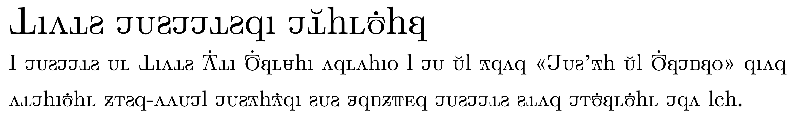

# Computer-Modern-Unicode-Oesol
Computer Modern Unicode Oesol (이하, CMUO)은 언어학자 외솔 최현배 선생이 그의 저서 《글자의 혁명》에서 제안한 풀어쓰기 한글 자모를 구현한 컴퓨터 글꼴입니다.

Computer Modern Unicode Oesol (henceforth, CMUO) is a computer font set for disassembled Hangul proposed in his *The Revolution of the Letter* by Choe Hyeon-bae (a. k. a. Oesol), a Korean linguist.

## PUA 코드 할당

CMUO가 포함하는 풀어쓰기 한글 자모는, 대문자와 소문자의 구분이 있고, 현행 〈한글 맞춤법〉에 없는 특수 자모들이 있다는 특성상, 부득이 Private Use Area에 배정하였으며, 각각의 코드는 다음과 같습니다:

- 대문자 (ㄱ–ㅎ) — U+E000–U+E00D
- 대문자 (ㅏ–ㅣ) — U+E00E–U+E017
- 대문자 (딴이, 짧은 ㅗ, 짧은 ㅜ, 짧은 ㅡ, 짧은 ㅣ) — U+E018–U+E01C
- 소문자 (ㄱ–ㅎ) — U+E01D–U+E02A
- 소문자 (ㅏ–ㅣ) — U+E02B–U+E034
- 소문자 (딴이, 짧은 ㅗ, 짧은 ㅜ, 짧은 ㅡ, 짧은 ㅣ) — U+E035–U+E039

“ㄸ”, “ㅒ” 등의 합자는 따로 글자를 만들거나 코드를 배당하지 않았으며, 자음자 이응의 순서는 《글자의 혁명》의 원안에서는 히읗의 뒤이지만, 현행 〈한글 맞춤법〉에 맞춰 시옷의 뒤에 배치하였습니다.

## PUA Code Assignment

CMUO distinguishes two letter cases and contains some special *jamo*s, which are altogether foreign to the current standard *Hangul Orthography*. For this reason, each *jamo* is assigned in the Private Use Area as follows:

- Uppercase (ㄱ–ㅎ) — U+E000–U+E00D
- Uppercase (ㅏ–ㅣ) — U+E00E–U+E017
- Uppercase (*ttan-i*, ㅗ with breve, ㅜ with breve, ㅡ with breve, ㅣ breve) — U+E018–U+E01C
- Lowercase (ㄱ–ㅎ) — U+E01D–U+E02A
- Lowercase (ㅏ–ㅣ) — U+E02B–U+E034
- Lowercase (*ttan-i*, ㅗ with breve, ㅜ with breve, ㅡ with breve, ㅣ breve) — U+E035–U+E039

Note that digraphs such as “ㄸ” and “ㅒ” are not assigned any separate glyphs or codes, and that “ㅇ” is placed right after “ㅅ” in accord with *Hangul Orthography,* though it is placed after “ㅎ” in the original proposal presented in *The Revolution of the Letter.*

## 특수 자모들에 대한 간단한 설명

- 딴이: “ㅏ”, “ㅓ”, “ㅗ”, 그리고 경우에 따라 “ㅜ” 등의 뒤에 붙어 “ㅐ”, “ㅔ”, “ㅚ”, “ㅟ”를 형성할 적에 쓰입니다. “ㅟ”는 《글자의 혁명》에서는 이중 모음으로 취급하여 딴이를 쓰지 않으나, 현행 〈표준어 규정〉을 따라 단모음으로 본다면, 딴이를 쓸 수도 있을 것입니다.
- 짧은 ㅗ: “ㅏ”, “ㅐ” 등의 앞에 붙어 /w/ 음소를 나타냅니다; “ㅘ”와 “ㅙ”의 “ㅗ”라고 생각하시면 됩니다.
- 짧은 ㅜ: “ㅓ”, “ㅔ”, “ㅣ” 등의 앞에 붙어 /w/ (또는 “ㅣ”의 경우 /ɥ/) 음소를 나타냅니다; “ㅝ”, “ㅞ”, “ㅟ”의 “ㅜ”라고 생각하시면 됩니다.
- 짧은 ㅡ: “ㅣ”의 앞에 붙어 /ɰ/ 음소를 나타냅니다; “ㅢ”의 “ㅡ”라고 생각하시면 됩니다.
- 짧은 ㅣ: /j/ 음소를 나타내며, 일반적인 표기에는 쓰이지 않고, 대신 “ㅑ”, “ㅒ”, “ㅕ”, “ㅖ”, “ㅛ”, “ㅠ” 등을 씁니다.

## A Brief Note on the Special Letters

- *Ttan-i*: Following “ㅏ”, “ㅑ”, “ㅓ”, “ㅕ”, “ㅗ” and possibly “ㅜ”, this forms “ㅐ”, “ㅒ” “ㅔ”, “ㅖ”, “ㅚ” and “ㅟ”, respectively. As for “ㅟ”, it is regarded as a diphthong in *The Revolution of the Letter* and thus not formed by attaching *ttan-i* to “ㅜ” there, but it may as well be reasonable to regard it a monophthong as in *Standard Language Regulations* and use *ttan-i*.
- ㅗ with breve: Preceding “ㅏ” and “ㅐ”, this represents the phoneme /w/; the “ㅗ” found in “ㅘ” and “ㅙ” for instance.
- ㅜ with breve: Preceding “ㅓ”, “ㅔ” and “ㅣ”, this represents the phoneme /w/ (or /ɥ/ for “ㅣ”); the “ㅜ” found in “ㅝ”, “ㅞ” and “ㅟ” for instance.
- ㅡ with breve: Preceding “ㅣ”, this represents the phoneme /ɰ/; the “ㅡ” found in “ㅢ” for instance.
- ㅣ with breve: This represents the phoneme /j/ and is not intended to be used in general writing. Use instead “ㅑ”, “ㅒ”, “ㅕ”, “ㅖ”, “ㅛ”, “ㅠ”, etc.

## 입력

이 글꼴로 입력하기 위해 다음의 수단을 이용할 수 있습니다:
- [Oesol-key](https://github.com/ZyntharSekki/Oesol-key): [ZyntharSekki](https://github.com/ZyntharSekki) 님의 날개셋 입력기용 자판 배열.
- [Oesol-Keyman](https://github.com/oysol/Oesol-Keyman): [oysol](https://github.com/oysol) 님의 Keyman 입력기용 자판 배열.
- [oysolscript](https://github.com/oysol/oysolscript): [oysol](https://github.com/oysol) 님의 Emacs용 Yale 로마자 표기법-외솔 풀어쓰기 간 변환기.
- [아무넣](https://phost.gitlab.io/wt/am/): [피리](https://gitlab.com/phost) 님의 웹 입력기.
- [oesolscript](https://bitbucket.org/novadh/oesolscript/src/master/): N. d. H. 님의 LaTeX 패키지.

글꼴 사용에 도움을 주심에 감사드립니다.

## Input Methods

You may take advantage of the following tools for input:
- [Oesol-key](https://github.com/ZyntharSekki/Oesol-key): A keyboard layout for Nalgaeset Hangul Input by [ZyntharSekki](https://github.com/ZyntharSekki).
- [Oesol-Keyman](https://github.com/oysol/Oesol-Keyman): A keyboard layout for Keyman by [oysol](https://github.com/oysol).
- [oysolscript](https://github.com/oysol/oysolscript): A Yale romanization to Oesol disassembled Hangul converter for Emacs by [oysol](https://github.com/oysol).
- [아무넣](https://phost.gitlab.io/wt/am/): A web IME by [피리](https://gitlab.com/phost).
- [oesolscript](https://bitbucket.org/novadh/oesolscript/src/master/): A LaTeX package by N. d. H.

Thanks for every contribution for the convenient use of the font.

## 그 밖의 사항들

이 글꼴은 Computer Modern Unicode를 기반으로 수정하여 만들어졌으며, Computer Modern Unicode와 동일하게 SIL Open Font License하에 배포됩니다. SIL Open Font License에 대한 더 자세한 정보는 [이곳](https://scripts.sil.org/cms/scripts/page.php?site_id=nrsi&id=OFL_web)에서 얻을 수 있습니다.

제작자 본인은 타이포그래피에 관한 전문 지식/기술을 갖추지 않았습니다. 이 때문에 글꼴이 다소간 조화롭지 못할 수 있다는 점을 유의하시기 바랍니다. 만약 개선하거나 수정하고 싶은 사항이 있다면, OFL License가 허용하는 한도 내에서, 자유로이 수정 및 재배포하실 수 있습니다.

## Miscellaneous

This font set is based on and modified from Computer Modern Unicode, and thereby also distributed under the SIL Open Font License. Visit [here](https://scripts.sil.org/cms/scripts/page.php?site_id=nrsi&id=OFL_web) for further information on the SIL Open Font License.

I don’t have much knowledge or technique on typography, so beware that the font might look more or less unbalanced. If you have something to improve or modify, to the extent allowed by the OFL License, you can freely modify and/or redistribute it.
